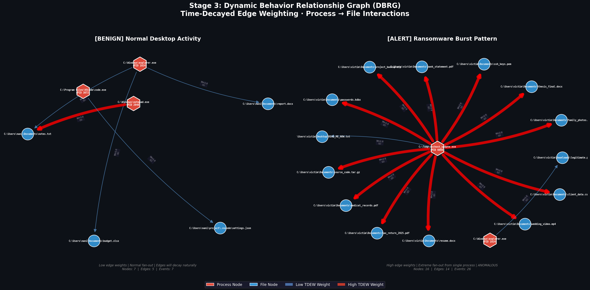

# 🛡️ Real-Time Non-Destructive Ransomware Defense System


-brightgreen?style=for-the-badge&logo=pytest)
-brightgreen?style=for-the-badge&logo=pytest)
-brightgreen?style=for-the-badge&logo=pytest)


> **A Machine Learning & OS-Kernel Level Defense Pipeline for Real-Time Ransomware Interception, Behavioral Threat Modeling, and Zero-Data-Loss Rollback.**

---

## 📌 Executive Overview

The **AI Ransomware Defense System** is a 12-stage enterprise security solution designed to observe low-level operating system events, model behavioral relationships using exponential time-decay dynamics, score threat intent via multi-signal corroborated machine learning, and enforce kernel-level isolation with zero-data-loss write-ahead journaling rollback capabilities.

> [!NOTE]
> **Design Principle — Non-Destructive by Default:**  
> Unlike traditional antivirus software that abruptly terminates processes or causes data loss, this system observes, models, and scores behavior continuously without altering execution until a quantified, multi-signal risk threshold is crossed.

---

## 🏗️ End-to-End System Architecture Roadmap

The pipeline is organized into **11 sequential execution stages** plus a **12th evaluation phase**:

```text
 ┌───────────────────────────────────────────────────────────────────────────────────┐
 │                            STAGE 1: TELEMETRY COLLECTION                          │  <-- COMPLETED & VERIFIED (20/20)
 │                Asynchronous File I/O Interception, Process Provenance             │
 └─────────────────────────────────────────┬─────────────────────────────────────────┘
                                           │ (eCAR JSON Telemetry Stream in SQLite)
                                           ▼
 ┌───────────────────────────────────────────────────────────────────────────────────┐
 │                      STAGE 2: PROCESS IDENTIFICATION & LINEAGE                    │  <-- COMPLETED & VERIFIED (14/14)
 │                 Provenance Tracing & Parent-Child Lineage Rarity (S_rel)          │
 └─────────────────────────────────────────┬─────────────────────────────────────────┘
                                           │ (Context-Enriched eCAR Events)
                                           ▼
 ┌───────────────────────────────────────────────────────────────────────────────────┐
 │                STAGE 3: DYNAMIC BEHAVIOR RELATIONSHIP GRAPH (DBRG)                │  <-- COMPLETED & VERIFIED (28/28)
 │                  Exponential Time-Decayed Edge Weighting (TDEW Engine)            │
 └─────────────────────────────────────────┬─────────────────────────────────────────┘
                                           │ (Live Process->File Directed Graph)
                                           ▼
 ┌───────────────────────────────────────────────────────────────────────────────────┐
 │                  STAGES 4–5: FEATURE EXTRACTION & ANOMALY MODEL                   │  <-- UPCOMING NEXT
 │           4KB Byte Entropy, One-Class Learning (Isolation Forest / Density)       │
 └─────────────────────────────────────────┬─────────────────────────────────────────┘
                                           │
                                           ▼
 ┌───────────────────────────────────────────────────────────────────────────────────┐
 │              STAGES 6–7: THREAT FUSION & DYNAMIC TRUST EVOLUTION ENGINE           │
 │           Sigmoidal Intent Drift, Momentum Penalty, Risk Tiers (SAFE -> CRITICAL) │
 └─────────────────────────────────────────┬─────────────────────────────────────────┘
                                           │
                                           ▼
 ┌───────────────────────────────────────────────────────────────────────────────────┐
 │             STAGES 8–10: CONTAINMENT, JOURNALING & ZERO-DATA-LOSS ROLLBACK        │
 │              Synthetic Harness, SIGSTOP Kernel Freeze, Edmonds-Karp Min-Cut      │
 └─────────────────────────────────────────┬─────────────────────────────────────────┘
                                           │
                                           ▼
 ┌───────────────────────────────────────────────────────────────────────────────────┐
 │                  STAGES 11–12: SOC DASHBOARD & ABLATION EVALUATION                │
 │             WebSocket UI, Isolate & Restore / Authorize & Resume Controls         │
 └───────────────────────────────────────────────────────────────────────────────────┘
```

---

## 🚦 Project Implementation Status Matrix

| Stage | Module Name | Primary Role | Status | Hand-off Notes |
|---|---|---|---|---|
| **Stage 1** | **Telemetry Collection** | File I/O Interception, Process Provenance, eCAR Schema, SQLite Store | ✅ **Completed & Verified** | 20/20 Pytest Suite Passed. Streams events to `telemetry.db` |
| **Stage 2** | **Lineage Analysis** | Parent-Child Provenance Tracing & Lineage Rarity ($S_{\text{rel}}$) | ✅ **Completed & Verified** | 14/14 Pytest Suite Passed. Enriches eCAR with lineage context |
| **Stage 3** | **DBRG Graph Engine** | NetworkX Directed Graph with TDEW Exponential Weight Decay | ✅ **Completed & Verified** | 28/28 Pytest Suite Passed. Builds live process-file interaction graph |
| **Stage 4** | **Feature Extraction** | 4KB Multi-layer feature extraction & byte entropy profiling | 📅 *Upcoming* | Reads file modification byte streams |
| **Stage 5** | **Benign Profiling** | One-Class Anomaly Model (Isolation Forest baseline) | 📅 *Upcoming* | Uses `Dataset/RansomwareData.csv` & `Code/preprocessing.ipynb` |
| **Stage 6** | **Threat Fusion** | Sigmoidal Intent Drift Acceleration Engine | 📅 *Upcoming* | Combines entropy, graph distance, & lineage signals |
| **Stage 7** | **Trust State Engine** | Momentum Trust Decay Engine & Risk Tiers (SAFE/VERIFY/CRITICAL) | 📅 *Upcoming* | Controls transitions between risk states |
| **Stage 8** | **Synthetic Harness** | Sandboxed Attack Simulator | 📅 *Upcoming* | Uses `Code/mock_ransomware.ipynb` for red-team validation |
| **Stage 9** | **Kernel Containment** | SIGSTOP / `NtSuspendProcess` Freeze-Graph Min-Cut Engine | 📅 *Upcoming* | Edmonds-Karp minimum cut capacity optimization |
| **Stage 10** | **Journaling & Rollback**| Write-Ahead Journaling Vault & Zero-Data-Loss Selective Rollback | 📅 *Upcoming* | Block-level file backup vault & restore engine |
| **Stage 11** | **SOC Dashboard** | FastAPI WebSocket Backend & Interactive React Cytoscape UI | 📅 *Upcoming* | Analyst-in-the-loop manual override UI |
| **Stage 12** | **Evaluation Sweep** | Parameter Ablation & Red-Team Defense Preparation | 📅 *Upcoming* | Parameter tuning across $\lambda, \beta, \gamma$ constants |

---

## 🕸️ Stage 3: Dynamic Behavior Relationship Graph (DBRG + TDEW)

Stage 3 translates flat eCAR events into a live, thread-safe directed graph of **Process Nodes $\rightarrow$ File Nodes**.

### Mathematical Foundation: Time-Decayed Edge Weighting (TDEW)

$$\text{Active Event Update: } W(e) = W_{\text{old}} \cdot e^{-\lambda \cdot \Delta t} + 1.0$$

$$\text{Passive Decay Sweep: } W_{\text{passive}} = W_{\text{old}} \cdot e^{-\lambda \cdot \Delta t}$$

* **Burst Acceleration ($\Delta t \approx 0$)**: Rapid modifications accumulate weight ($1.0 \rightarrow 2.0 \rightarrow 3.0 \dots$).
* **Exponential Decay ($\Delta t \gg 0$)**: Idle periods exponentially shrink weight toward zero.
* **Garbage Collection**: Background thread prunes edges where $W < 0.01$ and deletes orphan nodes.

### Visual Graph Output (Benign vs Ransomware Scenario)



```text
 Benign Pattern  : Low process out-degree (1-3 files), gradual TDEW decay.
 Ransomware Burst: High process out-degree (10-1000+ files), synchronous TDEW weight spikes.
```

### Sub-Module Specifications (`src/stage_3_dbrg/`)

1. **`src/stage_3_dbrg/tdew_calculator.py`**: TDEW math engine encapsulating active update and passive decay formulas.
2. **`src/stage_3_dbrg/dbrg_manager.py`**: Thread-safe NetworkX `DiGraph` wrapper with lock protection for concurrent ingestion.
3. **`src/stage_3_dbrg/garbage_collector.py`**: Background daemon thread conducting periodic passive decay sweeps and orphan cleanup.
4. **`src/stage_3_dbrg/visualize_dbrg.py`**: Matplotlib & NetworkX side-by-side graph rendering utility.

---

## 📁 Project Directory Structure

```text
ai-ransomware-defense-system/
├── collector/                    # 🛡️ Stage 1: Ingestion Pipeline
│   ├── __init__.py               # Package marker
│   ├── file_monitor.py           # Watchdog observer (50ms event deduplication)
│   ├── process_monitor.py        # Process monitor & mtime SHA-256 hash cache
│   ├── queue_joiner.py           # Thread-safe queue & 3-tier PID resolver
│   ├── ecar_formatter.py         # MITRE eCAR JSON schema formatter
│   ├── db_writer.py              # SQLite WAL persistence layer
│   └── main.py                   # Main orchestrator & Admin privilege checker
├── lineage/                      # 🌲 Stage 2: Lineage Analysis
│   ├── tracker.py                # Lineage tracker & process tree builder
│   ├── rarity_engine.py          # Lineage rarity score engine (S_rel)
│   ├── demo_events.json          # Demo event sample dataset
│   └── demo_replay.py            # Lineage demo replay utility
├── src/                          # ⚡ Stage 3+ Source Code
│   ├── __init__.py               # Root package marker
│   └── stage_3_dbrg/             # 🕸️ Stage 3: DBRG & TDEW Engine
│       ├── __init__.py           # Exports DBRGManager, TDEWEngine, GC
│       ├── tdew_calculator.py    # TDEW exponential decay formula calculator
│       ├── dbrg_manager.py       # Thread-safe NetworkX DiGraph manager
│       ├── garbage_collector.py  # Daemon thread for passive edge pruning
│       └── visualize_dbrg.py    # Graph visualization generator
├── tests/                        # 🧪 Automated & Manual Test Suite
│   ├── __init__.py
│   ├── test_stage1.py            # 20 automated tests for Stage 1
│   ├── test_stage2.py            # 14 automated tests for Stage 2
│   ├── test_stage_3_dbrg.py      # 28 automated tests for Stage 3
│   ├── manual_test_stage_3.py    # 6-item interactive manual verification CLI
│   └── demo_ransomware_scenario.py # Live ransomware scenario simulation demo
├── stage3_dbrg_graph.png         # 📊 Generated DBRG visualization diagram
├── config.yaml                   # ⚙️ System Configuration
└── README.md                     # 📖 Project Documentation
```

---

## 🚀 Quick Start & Verification Guide

### 1. Setup Environment
```bash
git clone https://github.com/Shanmukha-Gautam-Pidaparthi/ai-ransomware-defense-system.git
cd ai-ransomware-defense-system

pip install watchdog psutil pyyaml pytest networkx matplotlib numpy
```

### 2. Run All Automated Unit Test Suites (Stage 1 + Stage 2 + Stage 3)
```bash
python3 -m pytest tests/ -v
```

### 3. Run Stage 3 Interactive Manual Verification CLI
```bash
# Run all 6 verification items interactively
python3 tests/manual_test_stage_3.py

# Run a specific verification item (e.g. Item 2: Burst Acceleration)
python3 tests/manual_test_stage_3.py 2
```

### 4. Run Ransomware Attack Simulation Demo
```bash
python3 tests/demo_ransomware_scenario.py
```

### 5. Generate DBRG Graph Visualization
```bash
python3 src/stage_3_dbrg/visualize_dbrg.py
# Saves stage3_dbrg_graph.png to project root
```

---

## 📜 License

This project is open-source and available under the **MIT License**.
